# Mapping UK Climate Attitudes

**Bayesian Hierarchical Latent Trait Analysis, 2025**
Research collaboration with Looking for Growth · Data: Nationally representative UK survey (N=3,000)

[GitHub Repository](https://github.com/henrycgbaker/climate-attitudes-uk-2025-hierarchical-bayesian-model)

---

## The Core Insight

Public attitudes toward climate policy aren't one-dimensional. When we ask people about climate change, economic concerns, and political reform, we're actually tapping into three distinct underlying orientations that operate somewhat independently:

| Dimension | What it captures |
|-----------|------------------|
| **Economic Optimism (φ)** | Confidence in future economic prospects |
| **Environmentalism (θ)** | Prioritisation of environmental protection over economic growth |
| **Support for Radical Reform (ψ)** | Preference for systemic change versus maintaining the status quo |

Understanding how these dimensions interact—and who holds which combinations of views—offers practical guidance for climate policy communication and coalition-building.

---

## Why This Matters

Single survey questions asking whether someone "cares about climate change" miss substantial nuance. A person might strongly prioritise environmental protection while remaining pessimistic about the economy and sceptical of radical political change. Another might be economically optimistic, moderately pro-environment, and deeply opposed to systemic reform.

These different attitude profiles respond to different messages. Effective climate communication requires understanding this complexity.

---

## Key Findings

### Party Affiliation: The Biggest Predictor

Political party explains more variation in climate attitudes than any single demographic factor. The patterns challenge some conventional assumptions:

| Party | Economic Optimism | Environmentalism | Radical Reform |
|-------|-------------------|------------------|----------------|
| Labour | **+0.51** (highest) | +0.14 | -0.26 (lowest) |
| Liberal Democrats | +0.21 | **+0.17** (highest) | -0.13 |
| Conservative | +0.26 | +0.03 | -0.01 |
| Green | -0.09 | +0.09 | +0.03 |
| Reform UK | -0.23 | **-0.22** (lowest) | +0.13 |

*Values are party-level intercepts (deviations from the overall mean) on a standardised scale.*

**Striking finding:** The Greens rank third on environmentalism, behind Liberal Democrats and Labour. This suggests pro-environment concern has diffused broadly across centre-left parties, and Green voters may be motivated by a mix of environmental commitment and general anti-establishment sentiment (captured by higher radicalism scores).

**Labour's profile** is distinctive: highest economic optimism, strong environmentalism, but lowest support for radical reform. Labour voters want pragmatic environmental action within the existing system.

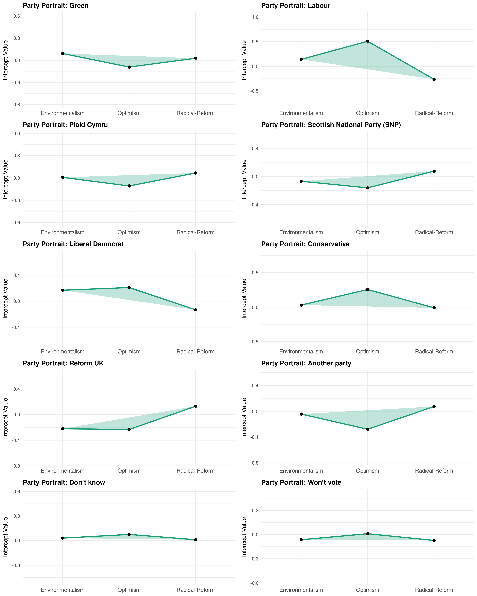
*Each party's position on economic optimism (φ), environmentalism (θ), and support for radical reform (ψ). Radar charts make party "shapes" immediately comparable.*

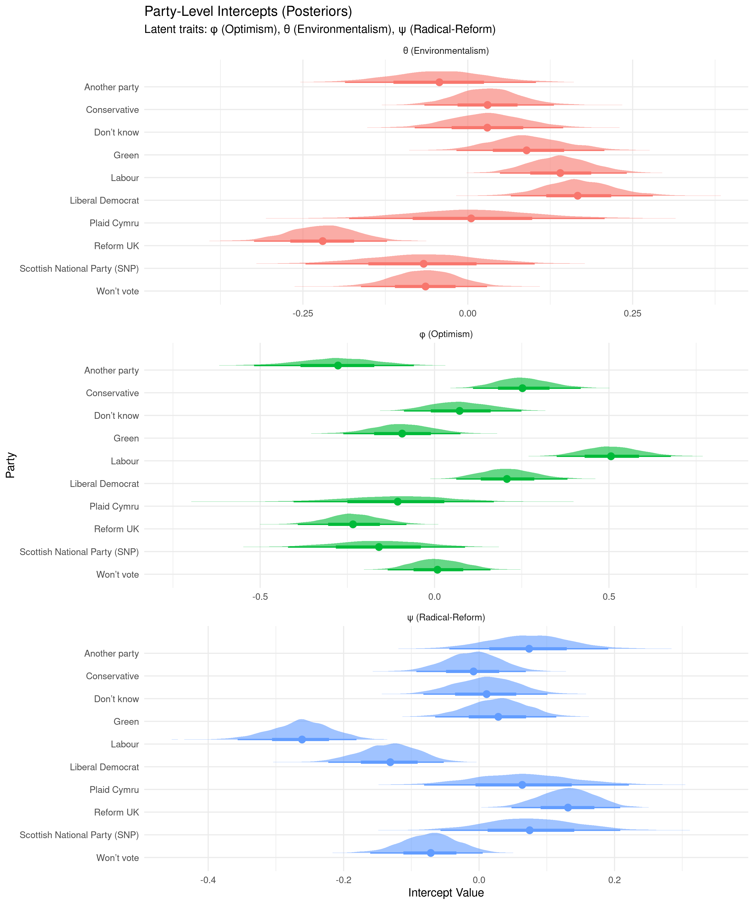
*Full posterior distributions for party-level intercepts on each latent dimension. Width indicates uncertainty; position indicates effect direction and magnitude.*

### Age Effects: A Counterintuitive Pattern

| Age Group | Optimism | Environmentalism | Radical Reform |
|-----------|----------|------------------|----------------|
| 18-24 (reference) | 0 | 0 | 0 |
| 25-34 | +0.07 | -0.00 | +0.06 |
| 35-44 | -0.00 | -0.03 | +0.11 |
| 45-54 | -0.25 | -0.18 | +0.20 |
| 55-64 | -0.31 | -0.19 | +0.22 |
| 65+ | **-0.38** | **-0.19** | **+0.26** |

Older cohorts are less optimistic and less environmentalist—but *more* supportive of radical reform. This suggests messaging around substantive systemic change could resonate with older demographics, while younger cohorts (already optimistic and pro-environment) may require different engagement strategies.

### Material Insecurity: Challenging the Conventional Wisdom

A standard assumption holds that material security is a prerequisite for supporting potentially economically-disruptive climate policy. Our data suggest otherwise:

- Higher material insecurity is associated with **greater** environmental concern (+0.16)
- Insecurity shows a slight **positive** relationship with economic optimism (+0.05)
- No significant effect on support for radical reform

This challenges the notion that economically vulnerable populations are necessarily opposed to green policies. Framing climate action around economic opportunity—job creation, cost savings, energy security—could mobilise these constituencies.

### Education: Surprisingly Weak Effects

University education (Level 4+) confers only a modest boost to environmentalism (+0.06), with the effect not reaching conventional statistical significance. Lower educational qualifications show no consistent pattern across dimensions.

This suggests environmental concern is not primarily driven by educational attainment, and climate communicators shouldn't assume less-educated populations are unreachable.

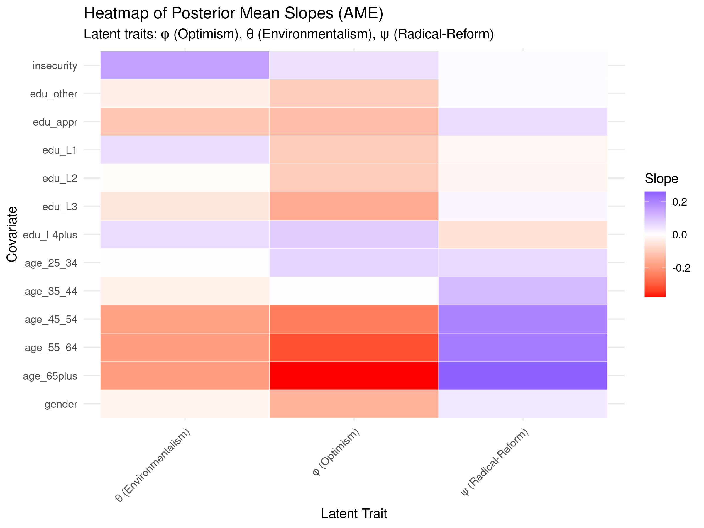
*Heatmap showing how demographic factors shift positions on each latent dimension. Darker colours indicate stronger effects.*

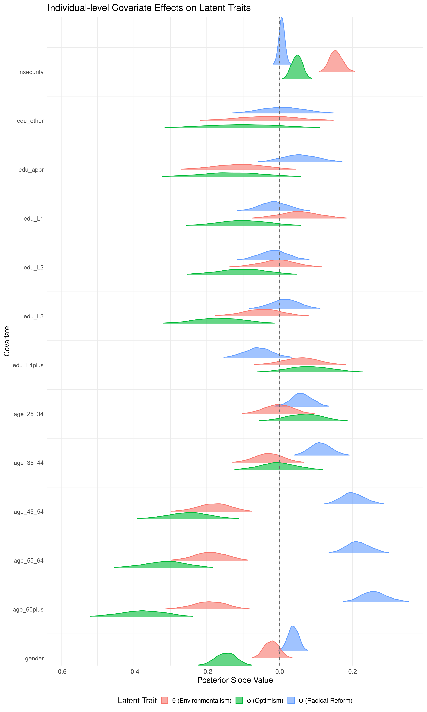
*Full posterior distributions for each covariate effect, showing uncertainty around point estimates.*

### Regional Variation: Minimal Once Demographics Are Controlled

After accounting for demographics and party affiliation, UK regions show remarkably similar attitude profiles:

- Environmentalism intercepts range from -0.07 (Wales) to +0.08 (London)—a span of just 0.15 standard deviations
- Economic optimism: London highest (+0.11), Yorkshire lowest (-0.05)
- Radical reform: all regional intercepts effectively zero

**Implication:** Regional variation in climate attitudes is largely explained by the demographic and political composition of those regions, not by distinctive regional cultures.

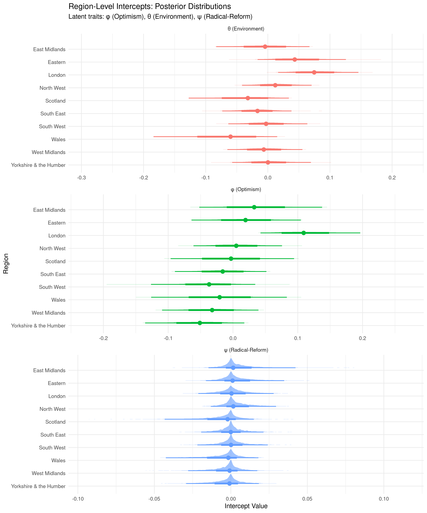
*Regional intercepts cluster tightly around zero for all three dimensions, indicating minimal residual geographic variation after controlling for demographics and party.*

---

## The Correlation Structure

How do these three dimensions relate to each other, after accounting for all predictors?

| Relationship | Correlation | Interpretation |
|--------------|-------------|----------------|
| Optimism ↔ Environmentalism | **+0.37** | People confident in the economy also tend to prioritise environment |
| Optimism ↔ Radical Reform | **-0.48** | Optimists prefer working within the existing system |
| Environmentalism ↔ Radical Reform | **-0.28** | Environmentalists are not primarily radical reformers |

The **positive correlation between optimism and environmentalism** is particularly noteworthy. Rather than a zero-sum framing (economy vs. environment), many Britons see economic confidence and environmental protection as compatible. This creates space for "optimistic green" messaging that emphasises opportunity rather than sacrifice.

The **negative correlation between environmentalism and radicalism** suggests that most environmentally-concerned citizens prefer pragmatic, incremental approaches over systemic upheaval.

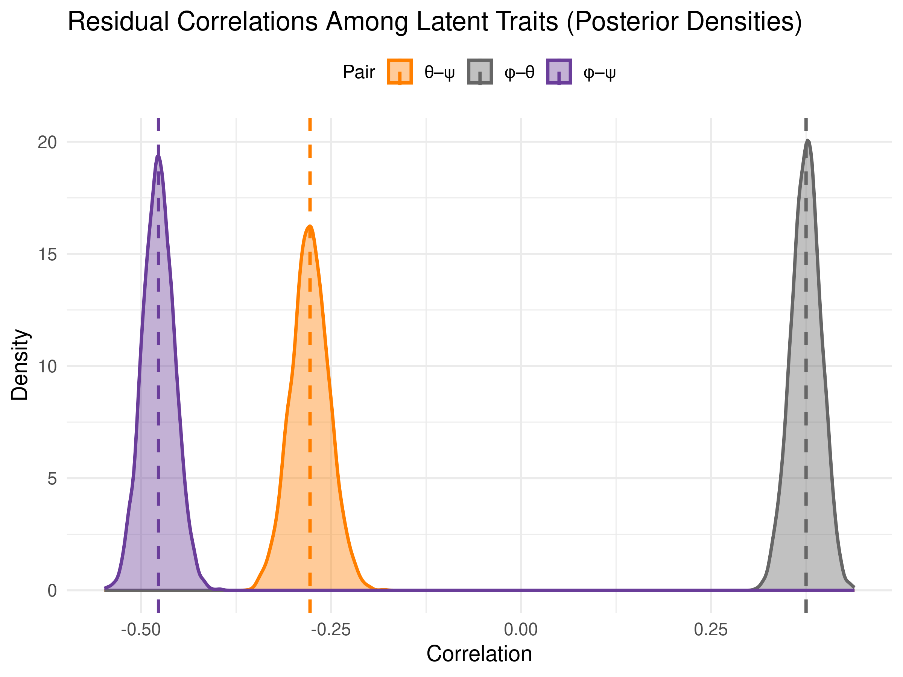
*Posterior distributions of residual correlations between the three attitude dimensions, with point estimates marked.*

---

## Audience Segmentation

The multidimensional structure allows us to identify distinct audience segments:

### Optimistic Environmentalists (high φ, high θ, low ψ)
- **Profile:** Economically confident, pro-environment, prefer working within the system
- **Likely demographics:** Labour/LibDem supporters, younger, urban
- **Messaging:** Emphasise practical solutions, green jobs, technological innovation
- **Size:** Large segment—the correlation structure suggests this is common

### Pessimistic Status-Quo Supporters (low φ, low θ, low ψ)
- **Profile:** Economically worried, less environmentally concerned, but not seeking radical change
- **Likely demographics:** Conservative/Reform UK, older, economically insecure
- **Messaging:** Frame green policies around economic security and cost reduction
- **Approach:** Avoid "climate emergency" framing; focus on tangible benefits

### Radical Reformers (low φ, variable θ, high ψ)
- **Profile:** Dissatisfied with current system, may or may not be specifically environmental
- **Likely demographics:** Fringe party supporters, mixed demographics
- **Messaging:** May respond to systemic critique but represent a smaller segment
- **Note:** Not a natural coalition for mainstream climate policy

---

## Example Personas

The model generates full posterior distributions over latent traits for any hypothetical individual defined by their demographic and political characteristics. Below are four contrasting profiles illustrating the range of predicted attitude positions:

### Young Green Voter (London)
**Profile:** 18-24 female, Green Party supporter, university degree, low material insecurity, London

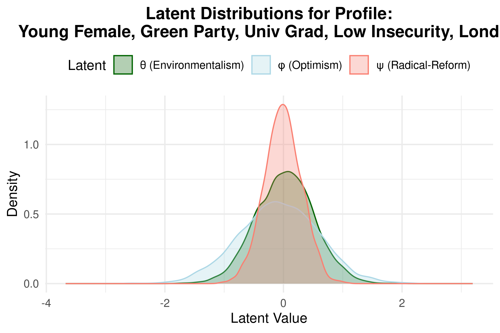

**Interpretation:** High environmentalism, moderate optimism, low radicalism—the "pragmatic young green" archetype.

### Older Reform UK Voter (South East)
**Profile:** 65+ male, Reform UK supporter, no qualifications, high material insecurity, South East

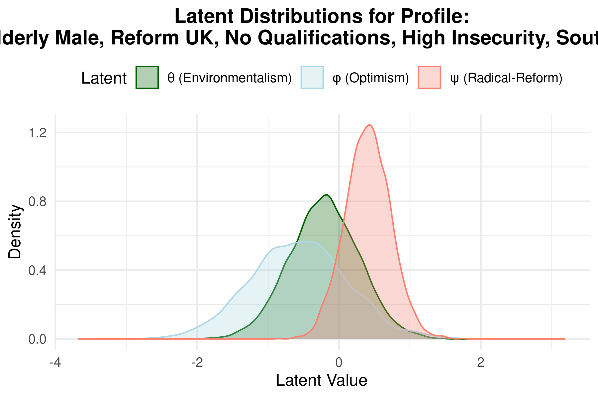

**Interpretation:** Low optimism (φ ≈ -0.60), below-average environmentalism (θ ≈ -0.26), above-average radicalism (ψ ≈ +0.40). Economically pessimistic and open to systemic change.

### Middle-Aged Labour Voter (North West)
**Profile:** 45-54 female, Labour supporter, university degree, low material insecurity, North West

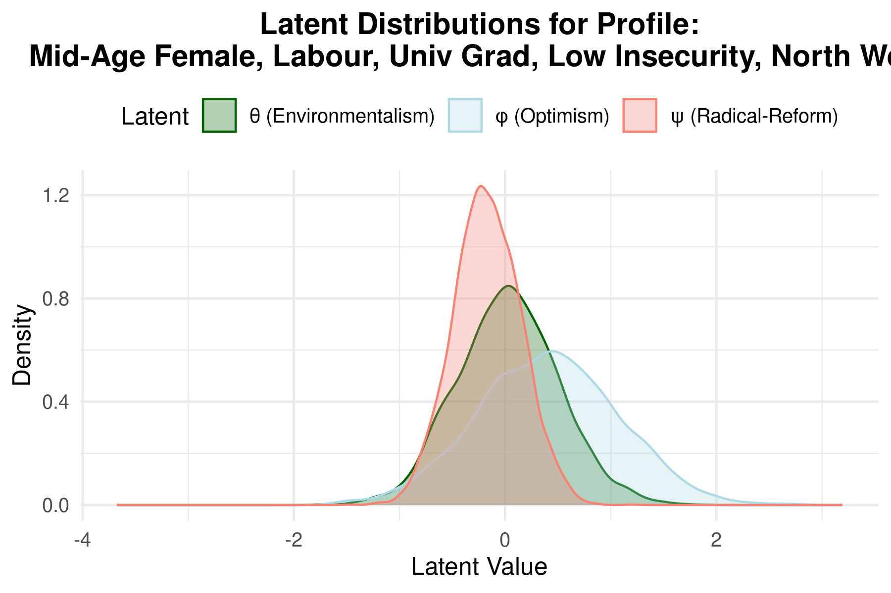

**Interpretation:** Moderate optimism (φ ≈ +0.15), slightly below-average environmentalism, strong preference for status quo (low ψ). The mainstream Labour base.

### Senior Liberal Democrat Voter (South West)
**Profile:** 65+ male, Liberal Democrat supporter, university degree, low material insecurity, South West

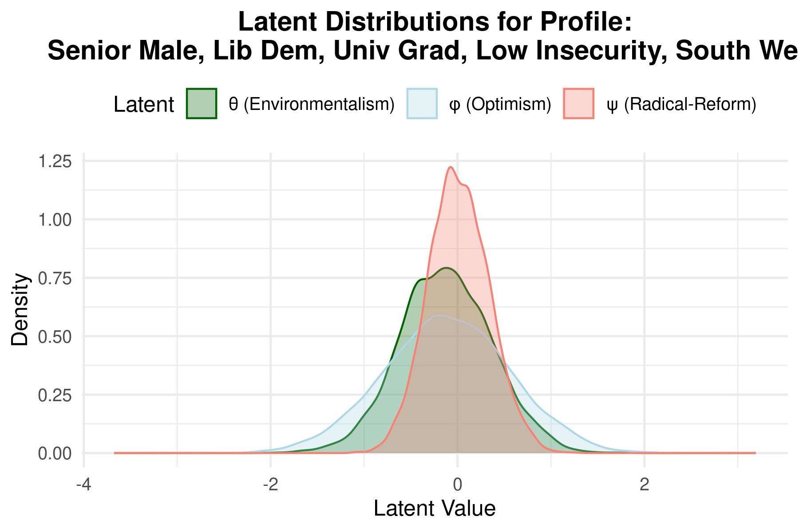

**Interpretation:** Despite older age, maintains high environmentalism due to party affiliation effect, with moderate optimism and low radicalism.

These profiles demonstrate how the model combines party, demographic, and regional effects to generate nuanced individual-level predictions with full uncertainty quantification.

---

## Technical Approach

### Model Overview

The analysis employs a **Bayesian hierarchical latent trait model** with two integrated components:

1. **Measurement models** linking observed survey items to three latent traits
2. **Structural model** specifying how latent traits vary by demographics, party, and region

### Measurement Models

For each latent dimension, we specify a linear factor model linking observed (standardised) survey responses to the underlying trait. Given respondent *i* and item *j*:

**Economic Optimism (6 items):**

$$Y^{(\phi)}_{ij} = \alpha^{(\phi)}_j + \lambda^{(\phi)}_j \phi_i + \varepsilon^{(\phi)}_{ij}, \quad \varepsilon^{(\phi)}_{ij} \sim \mathcal{N}(0, \sigma^{2(\phi)}_j)$$

**Environmentalism (5 items):**

$$Y^{(\theta)}_{ik} = \alpha^{(\theta)}_k + \lambda^{(\theta)}_k \theta_i + \varepsilon^{(\theta)}_{ik}, \quad \varepsilon^{(\theta)}_{ik} \sim \mathcal{N}(0, \sigma^{2(\theta)}_k)$$

**Support for Radical Reform (8 items):**

$$Y^{(\psi)}_{i\ell} = \alpha^{(\psi)}_\ell + \lambda^{(\psi)}_\ell \psi_i + \varepsilon^{(\psi)}_{i\ell}, \quad \varepsilon^{(\psi)}_{i\ell} \sim \mathcal{N}(0, \sigma^{2(\psi)}_\ell)$$

Where:
- $\alpha_j$ = item intercept (expected response when latent trait = 0)
- $\lambda_j$ = factor loading (item's sensitivity to the latent trait)
- $\sigma_j$ = residual standard deviation

**Identification constraints:** All loadings $\lambda > 0$ (via log-normal priors), and latent traits have unit variance.

### Structural Model

The three latent traits are modelled jointly as a multivariate hierarchical regression:

$$\boldsymbol{\eta}_i = \begin{pmatrix} \phi_i \\ \theta_i \\ \psi_i \end{pmatrix} \sim \mathcal{N}_3\left( \boldsymbol{\alpha}_{r_i} + \boldsymbol{\delta}_{q_i} + B\mathbf{X}_i, \; \Omega \right)$$

Where:
- $\boldsymbol{\alpha}_r \in \mathbb{R}^3$ = region-level random intercepts for region $r$
- $\boldsymbol{\delta}_q \in \mathbb{R}^3$ = party-level random intercepts for party $q$
- $B \in \mathbb{R}^{3 \times 13}$ = matrix of covariate effects (gender, age, education, material insecurity)
- $\mathbf{X}_i \in \mathbb{R}^{13}$ = individual covariate vector
- $\Omega$ = residual correlation matrix between latent dimensions

Expanding by dimension:

$$\phi_i = \alpha_{r_i,1} + \delta_{q_i,1} + B_{1,\cdot}\mathbf{X}_i + \xi_{i,1}$$

$$\theta_i = \alpha_{r_i,2} + \delta_{q_i,2} + B_{2,\cdot}\mathbf{X}_i + \xi_{i,2}$$

$$\psi_i = \alpha_{r_i,3} + \delta_{q_i,3} + B_{3,\cdot}\mathbf{X}_i + \xi_{i,3}$$

Where $(\xi_{i,1}, \xi_{i,2}, \xi_{i,3})^\top \sim \mathcal{N}(\mathbf{0}, \Omega)$ captures residual correlation.

### Residual Correlation Matrix

The residual covariance $\Omega$ is constrained to be a correlation matrix (unit diagonal):

$$\Omega = \begin{pmatrix} 1 & \rho_{\phi\theta} & \rho_{\phi\psi} \\ \rho_{\phi\theta} & 1 & \rho_{\theta\psi} \\ \rho_{\phi\psi} & \rho_{\theta\psi} & 1 \end{pmatrix}$$

This captures relationships between dimensions *after* accounting for all observed predictors.

### Non-Centered Parameterisation

For efficient MCMC sampling, we use non-centered parameterisations for all random effects:

**Latent residuals:**
$$\mathbf{z}_i \sim \mathcal{N}_3(\mathbf{0}, I_3), \quad \boldsymbol{\eta}_i = \mu_i + L_\eta \mathbf{z}_i$$

Where $L_\eta$ is the Cholesky factor of $\Omega$, and $\mu_i = \boldsymbol{\alpha}_{r_i} + \boldsymbol{\delta}_{q_i} + B\mathbf{X}_i$.

**Region intercepts:**
$$\boldsymbol{\alpha}^{\text{raw}}_r \sim \mathcal{N}_3(\mathbf{0}, I_3), \quad \boldsymbol{\alpha}_r = D_\alpha L_\alpha \boldsymbol{\alpha}^{\text{raw}}_r$$

Where $D_\alpha = \text{diag}(\sigma_{\alpha,1}, \sigma_{\alpha,2}, \sigma_{\alpha,3})$ and $L_\alpha \sim \text{LKJ}(2)$.

**Party intercepts:** Analogous construction with $D_\delta$ and $L_\delta$.

### Prior Specification

| Parameter | Prior | Rationale |
|-----------|-------|-----------|
| Factor loadings $\lambda_j$ | $\text{LogNormal}(\log 1, 0.2)$ | Ensures positivity, centres near 1 |
| Item intercepts $\alpha_j$ | $\mathcal{N}(0, 0.5)$ | Weakly informative, allows data to dominate |
| Residual SDs $\sigma_j$ | $\mathcal{N}^+(1, 0.2)$ | Centres near unit variance |
| Covariate slopes $B$ | $\mathcal{N}(0, 0.5)$ | Most standardised effects within ±1 |
| Group SD $\sigma_{\alpha}, \sigma_{\delta}$ | $\mathcal{N}^+(0, 0.1)$ | Regularises group-level variation |
| Correlation matrices | $\text{LKJ}(2)$ | Slight preference for uncorrelated |
| Latent SDs $\tau_\eta$ | $\mathcal{N}^+(0, 0.3)$ for φ,θ; $\mathcal{N}^+(0, 0.1)$ for ψ | Tighter for radical reform |

Priors were refined via prior predictive checks to ensure reasonable coverage of observed data.

### Estimation & Convergence

- **Software:** Stan (MCMC via NUTS sampler)
- **Chains:** 4 parallel chains, 3,000 iterations each (1,000 warmup)
- **Convergence diagnostics:**
  - All $\hat{R} < 1.01$
  - Bulk and tail ESS ≥ 200 for all parameters
  - No divergent transitions
  - BFMI > 0.2 (adequate energy exploration)
  - Trace plots show good mixing

### Model Fit & Reliability

| Metric | Optimism (φ) | Environmentalism (θ) | Radical Reform (ψ) |
|--------|--------------|----------------------|--------------------|
| Factor reliability (ω) | 0.94 | 0.90 | 0.93 |
| Variance explained (R²) | 0.61 | 0.39 | 0.22 |
| % variance by items | 77% | 76% | 79% |

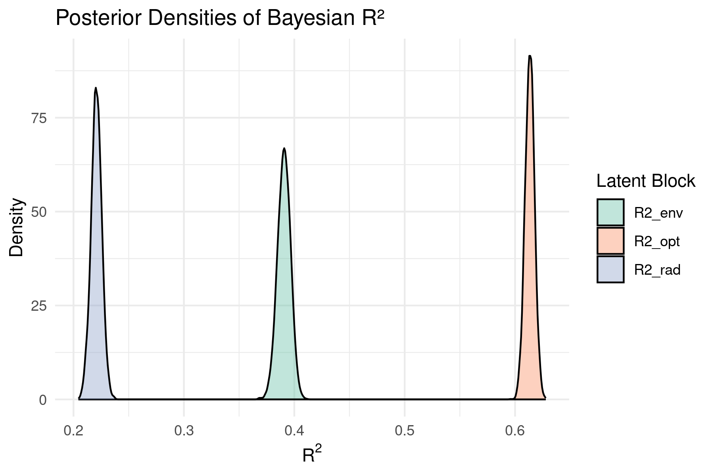
*Full posterior distributions of Bayesian R² for each latent dimension. Optimism is best explained by the predictors; radical reform attitudes remain largely idiosyncratic.*

Posterior predictive checks confirm the model successfully replicates observed data distributions and group-level patterns.

### Limitations

- **Ordinal items treated as continuous:** A cumulative probit/logit (graded response) model would be more rigorous for Likert-scale responses
- **Additive effects only:** No covariate interactions (e.g., age × party) or latent × latent interactions currently modelled
- **Cross-sectional data:** No causal claims; attitudes measured at one point in time
- **Social desirability bias:** Self-reported environmental attitudes may be inflated, potentially varying by demographic group
- **Proprietary data:** Original survey data from Looking for Growth partnership not publicly available (synthetic data generation scripts provided for methodology testing)

---

## Implications for Climate Communication

### Frame Around Opportunity, Not Sacrifice

The positive optimism-environmentalism correlation suggests "win-win" framing resonates. Emphasise:
- Green jobs and economic growth
- Energy cost savings
- Technological leadership

### Don't Assume Demographics Determine Attitudes

- Education effects are weak
- Material insecurity doesn't preclude environmental concern
- Regional differences are compositional, not cultural

### Recognise Party as Primary

Political identity is the strongest predictor. Consider:
- Labour voters: pragmatic green policy within existing system
- LibDem voters: strongest environmentalists, moderate reformers
- Conservative voters: frame around economic opportunity and national interest
- Reform UK voters: focus on tangible economic benefits, avoid "radical" framing

### Tailor by Age, But Carefully

- Older cohorts: may respond to reform messaging despite lower environmentalism
- Younger cohorts: already engaged; offer participation and agency

---

## Future Directions

- **MRP extension:** Post-stratification to estimate constituency-level attitude distributions
- **Multivariate policy outcomes:** Model support for specific policies (carbon tax, renewables subsidies) as functions of latent traits
- **Temporal dynamics:** Track attitude shifts with longitudinal data
- **Interaction effects:** Explore how covariates combine (e.g., age × party effects)

---

_Research note submitted June 2025. Full methodology documentation available in the [GitHub repository](https://github.com/henrycgbaker/climate-attitudes-uk-2025-hierarchical-bayesian-model)._

[← Back to Research](/research/)
