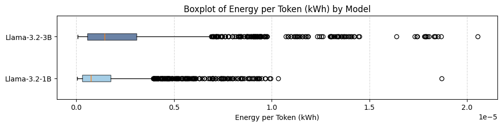
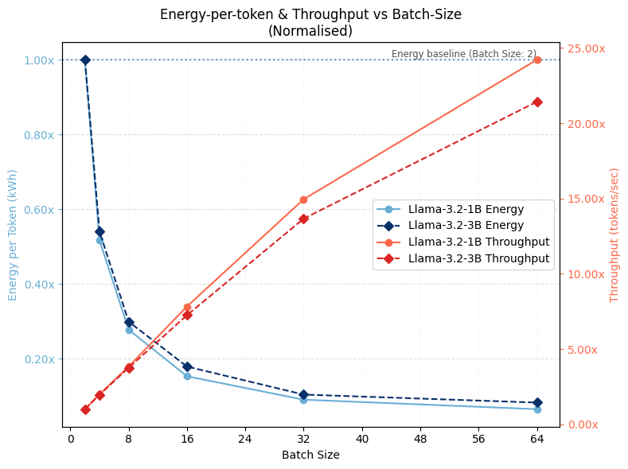
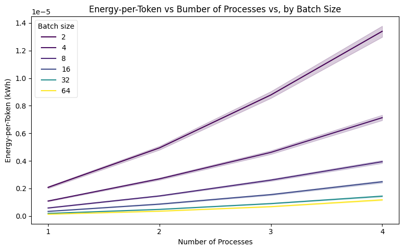
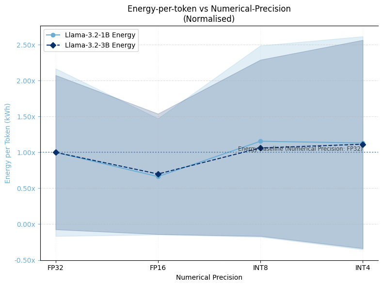
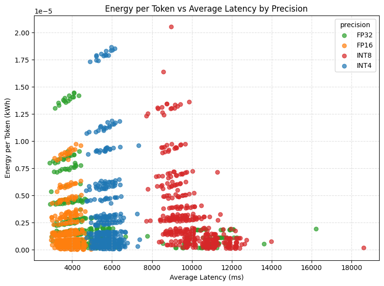
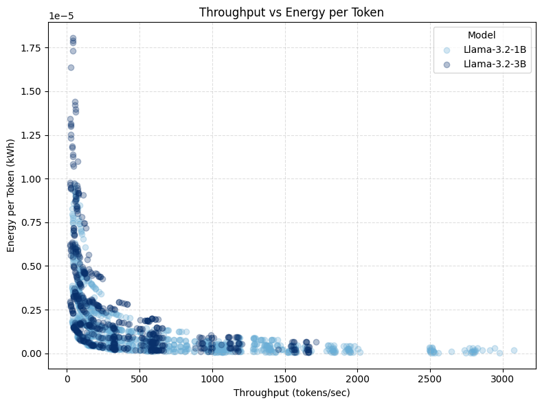

# Benchmarking LLM Energy Efficiency

**Masters of Data Science for Public Policy Thesis, 2025**
Hertie School of Governance · Advisor: Prof. Lynn Kaack · **Data Science Thesis Award 2025**

[Download Thesis (PDF)](/assets/files/research/llm-energy-efficiency-thesis.pdf) · [GitHub: LLenergyMeasure](https://github.com/henrycgbaker/LLenergyMeasure)

---

## The Problem

The adoption of large language models across digital services has led to increased scrutiny over their energy costs. Data-centre demand from AI workloads is projected to more than quadruple by 2030, potentially accounting for 9-12% of total energy demand in the US. Crucially, **inference-time consumption now dominates AI energy usage**—Google and Meta report 60-70% of their AI-driven energy consumption is inference-related, with Amazon Web Services reporting 80-90% of their ML cloud compute is inference-related. Accurately estimating and reducing inference-time energy is vital to broader AI sustainability efforts.

### The Green AI Movement

Within the ML community, attention to AI's environmental impact has grown substantially. The _Green AI_ movement, formalised as an efficiency-oriented alternative to the prevailing _Red AI_ paradigm of "performance at any cost," has catalysed research quantifying the environmental impacts of machine learning. Complementary _Sustainable AI_ frameworks advocate for holistic lifecycle-wide approaches to AI sustainability, spanning training, inference, and deployment.

### The Limitations of FLOPs as a Proxy

A common simplifying assumption is to take the number of **FLOPs** (floating-point operations) required per generated token as a proxy for inference-time energy costs. This assumption is closely aligned with parameter-counting heuristics that dominate model selection processes and continues to influence emerging AI policy discourse.

However, FLOPs are analytically computed as deterministic functions of model architecture and input-output characteristics:

> FLOPs = f(number of parameters, input length, output length)

FLOPs quantify the number of arithmetic operations required to generate a given output, but they do not capture the **energy efficiency with which those operations are executed**. While correlated, FLOPs and inference-time energy consumption are conceptually distinct. Energy consumption is shaped both by:

- **Upstream (development-phase) choices:** model architecture and parameterisation
- **Downstream (deployment-phase) choices:** how efficiently the computation graph is executed in practice

**The core insight:** Two systems with the same theoretical compute requirement may exhibit markedly different energy profiles. Implementation-level factors—how models are deployed—can induce substantial variation in energy consumption, even when FLOPs counts remain constant.

To illustrate: the same model, with identical FLOPs-per-token, can exhibit dramatically different energy profiles:

| Configuration | FLOPs per Token | Energy per Token | Ratio |
|---------------|-----------------|------------------|-------|
| Single GPU, batch=1, FP32 | X | 1.0× (baseline) | — |
| Single GPU, batch=32, FP16 | X | 0.15× | 6.7× more efficient |
| 4 GPUs, batch=1, FP32 | X | 4.2× | 4.2× *less* efficient |

Same model, same FLOPs, wildly different energy costs. **How you deploy matters as much as what you deploy.**

### Why This Matters for Policy

FLOP-counting narrows policy attention to immutable model attributes, conceptually restricting the scope of intervention to the moment of model selection. This framing overlooks downstream system-level implementation decisions and tradeoffs that shape the energy efficiency of real-world deployments. From a benchmarking perspective, the neglect of implementation-level variation translates to a lack of standardised test-time controls—creating opportunities for motivated actors to present artificially efficient performance metrics by testing under unrealistic configurations.

---

## Methodology

This study presents an empirical analysis of LLM inference-time efficiency, holding computational workload constant (ensuring fixed FLOPs-per-token) and measuring energy-per-token under a range of deployment configurations.

### Experimental Design

The configuration space is explored through a **within-model grid search** across **2,112 unique configurations**:

| Component | Details |
|-----------|---------|
| **Models** | LLaMA 3.2-1B and LLaMA 3.2-3B (lightweight, open-weight LLMs) |
| **Task** | Causal language modelling with fixed 500-token input/output sequences |
| **Dataset** | 128 prompts from Hugging Face's AI Energy Score benchmark (WikiText, OSCAR, UltraChat) |

### Parameters Tested

The grid search varied the following implementation parameters, selected based on accessibility to LLM service providers and prior evidence of energy effect:

- **Tensor parallelism:** 1-4 GPUs (degree of model layer distribution)
- **Batch size:** 1-64 prompts (request aggregation)
- **Numerical precision:** FP32, FP16, INT8, INT4 (precision and quantisation)
- **Decoding strategy:** Greedy, vanilla-multinomial, Top-p, Top-k sampling
- **Simulated latency:** Delay severity and patterns (constant vs bursty)

### Hardware & Software

All experiments ran on a shared single-node server:
- **GPUs:** 4× NVIDIA A100-PCIE-40GB
- **CPUs:** 128× AMD EPYC 7742 64-core
- **Software:** Ubuntu Linux 20.04, PyTorch 2.5.1, Accelerate 1.4.0

### Measurement Approach

Energy measurements were obtained via **CodeCarbon** software profilers, reflecting the emerging standard in ML energy analysis (±10-15% accuracy). The full configuration space was executed twice across non-contiguous experimental cycles over separate weeks to mitigate environmental noise from operating on a shared server.

Each run was initiated via a fresh command-line invocation to fully reinitialise the distributed environment, with three dummy forward passes to trigger lazy initialisations (discarded from measurement).

---

## Key Findings

### Overall Variability

Through a comprehensive grid search of implementation parameters, this research demonstrates substantial variability in energy efficiency:

| Model        | Mean (kWh/token) | Max/Min Fold | 95/5 Percentile Fold | CV (%) |
| ------------ | ---------------- | ------------ | -------------------- | ------ |
| LLaMA-3.2-1B | 1.44×10⁻⁶        | 516.5×       | 61.0×                | 127.7% |
| LLaMA-3.2-3B | 2.64×10⁻⁶        | 293.5×       | 51.0×                | 123.5% |

Both models exhibit positively skewed energy outcome distributions, with long right tails capturing high-energy outliers. While the two models show considerable overlap in their energy profiles—highlighting that **deployment choices can outweigh architectural complexity**—the 3B model incurs a higher median energy-per-token.

Notably, when normalised by each model's mean, the 1B model's coefficient of variation (127.7%) exceeds that of the 3B (123.5%), indicating that **smaller models can be just as sensitive to implementation-level decisions**.

_Distribution of energy outcomes showing substantial variability within each model._

### Realistic Deployment Scenarios

While the explored parameter space includes many impractical configurations, simulating six plausible deployment scenarios yields more actionable figures:

| Scenario Type | 1B Fold Range | 3B Fold Range |
|---------------|---------------|---------------|
| Realistic deployments | 4.3× (CV: 61%) | 4.9× (CV: 58%) |

Even within realistic production constraints, **implementation choices induce 4-5× variation** in energy-per-token.

### Real-World Energy Comparisons

To contextualise what these energy costs mean in practice, the table below compares the number of 300-token LLM responses equivalent to familiar energy expenditures (for the 3B model):

| Appliance | Usage | Least Efficient | Most Efficient |
|-----------|-------|-----------------|----------------|
| iPhone 16 | Full charge | 7 responses | 19 responses |
| MacBook Pro (M3) | Full charge | 40 responses | 116 responses |
| WiFi Router | 24 hours | 64 responses | 186 responses |
| HD Streaming | 1 hour | 35 responses | 103 responses |
| Google Search | 1 query | 0.13 responses | 0.39 responses |
| Electric Kettle | 1 litre boil | 129 responses | 67 responses |

_Note: These figures are illustrative, based on estimated energy values for consumer appliances._

---

## Detailed Analysis

### Tensor Parallelism

Increasing the number of processes over which model layers are distributed leads to a **moderately super-linear increase** in energy-per-token. Tensor parallelism has **the largest effect of all tested parameters**, with both models more than doubling energy consumption with the addition of a single extra process, then scaling up to 4× and 6× under 3 and 4 processes respectively.

This behaviour reflects a naive unoptimised implementation and is consistent with known limitations when model size is small relative to available GPU capacity. As (underutilised) GPUs are added:

1. Another device needs powering
2. Energy overheads from inter-device communication and coordination increase disproportionately to realised throughput gains

Both models' variance in energy outcomes across the entire grid search also grows with parallelism, reflecting both scale and increased instability from communication-heavy, fragmented scheduling. Leveraging more sophisticated parallel execution strategies would likely alter these scaling dynamics.

### Batch Size Effects

_Normalised throughput across different batch sizes._

Batch size reveals a **steep inverse relationship** with energy-per-token: in the small-batch regime, fixed overheads dominate, while beyond a certain point the curve plateaus, reflecting compute and memory-bandwidth saturation. The lower bound is reached for both models at around 10% of the double-batch baseline (a 10× range, excluding single batches).

Energy-per-token falls as throughput rises, demonstrating that **batching-driven efficiency gains stem primarily from throughput improvements**. Larger batches improve device utilisation and partially offset inefficiencies from parallelism.

_Batch size moderates the effect of tensor parallelism on energy efficiency._

### Precision and Quantisation

_Effect of numerical precision on normalised energy consumption._

Energy-per-token does **not** decrease monotonically with precision reductions:

- **FP32 → FP16:** Yields energy efficiency gains of 35-40% for both models
- **FP16 → INT8/INT4:** Shows efficiency losses of 5-10%, suggesting that realised energy savings from quantisation are **conditional on backend-level integration**

This finding highlights that quantisation benefits depend heavily on how well the inference framework is optimised for lower-precision operations.

### Decoding Strategy

Decoding strategy exhibited **minimal direct energy impact**—all curves remained within 5% of baseline:

- **Greedy decoding** (temperature 0) exhibited lowest energy-per-token costs
- **Vanilla-multinomial sampling** was most efficient among stochastic strategies
- **Top-k** and **Top-p** sampling showed slightly higher energy costs

This suggests LLM providers can select sampling strategies based on **application-specific criteria** (output quality, diversity) rather than energy efficiency concerns.

### Latency-Energy Tradeoffs

_The relationship between latency and energy consumption varies by precision level._

Energy efficiency steadily degrades as simulated latency increases, with larger declines under bursty conditions—albeit with modest overall effect sizes. Because this latency models exogenous communication delays (network congestion, scheduling jitter) rather than compute bottlenecks, the efficiency loss reflects reduced throughput: GPUs remain powered longer but perform less useful work per unit time.

Burstiness further exacerbates inefficiency, though the relationship is not uniform. Smaller burst sizes (5-8 queries) exhibit consistently higher inefficiencies, whereas larger bursts (10-20 queries) resemble constant latency profiles—suggesting modern GPUs exploit burst-locality to regain uninterrupted computation stretches.

---

## Throughput & Device Utilisation

Prior work has considered throughput and device utilisation rates as determinants of inference-time energy efficiency. This study proposes that together they capture **computational and non-computational aspects of energy efficiency** in deployed LLM systems.

### The Throughput-Energy Frontier

_The convex relationship between throughput and energy-per-token._

For systems characterised by **throughput-inefficiency** (operating at low throughput, within their throughput-power Pareto frontier), small throughput increases yield large reductions in energy-per-token. Beyond an inflection point—indicating proximity to the system's throughput-efficiency frontier—further throughput gains no longer improve energy efficiency, but instead require proportionate increases in power draw.

This convex non-linearity allows the optimal throughput configuration set to be conceptualised as a **constrained optimisation problem** under service-level objective (SLO) conditions.

### Practical Implications

- **Throughput-inefficient regime:** Configurations that increase throughput—such as larger batch sizes or lower precision—yield substantial energy-per-token improvements
- **Near-frontier regime:** Adding more GPUs shows little benefit until the system is already operating near peak utilisation

Device utilisation captures a different set of non-computational inefficiencies. In efficient deployments, utilisation should remain consistently high; persistent underutilisation indicates specific sources of energy waste—as is often the case in deployed systems where utilisation rates have been reported as low as **23-27%**.

From a policy perspective, throughput and device utilisation offer more insightful characterisation of runtime energy dynamics than analytical metrics like FLOPs, and provide a deployment-sensitive basis for benchmarking deployed systems.

---

## Discussion

### Implementation Matters

Deployment decisions substantially affect inference-time energy outcomes—to an extent under-acknowledged in _Sustainable AI_ discourse. This study shows that variation induced by implementation **can well exceed that attributable to model size alone**. LLM energy efficiency should be conceptualised not at the level of abstract model architectures, but as a property of implemented systems shaped by concrete deployment choices.

### Parameter Effects & Tradeoffs

While the precise mechanisms driving inference-time energy consumption are complex, this study identifies key tunable parameters: **batching, tensor parallelism, and numerical precision**. Even amongst this initial set, interaction effects and performance tradeoffs underscore the need for joint optimisation frameworks:

| Parameter | Energy Impact | Tradeoff |
|-----------|---------------|----------|
| Batch size | High (10×) | Responsiveness vs efficiency |
| Tensor parallelism | Very high (6×) | Scale vs coordination overhead |
| Precision/quantisation | Moderate (35-40%) | Quality vs efficiency |
| Decoding strategy | Minimal (<5%) | Quality/diversity concerns only |

Aggressive quantisation and deterministic decoding degrade generation quality, while larger batch sizes reduce responsiveness for real-time applications but improve efficiency—more so in highly-distributed inference environments.

### Implications for Benchmarking Standards

Prevailing conceptualisations of LLM energy efficiency emphasise analytical over empirical measures, and model attributes over system dynamics. Early benchmarking frameworks neglect the role of implementation-level factors as necessary controls.

To illustrate the extent of possible distortion by motivated actors at test-time: comparing over-optimised configurations (designed to maximise throughput without practical constraints) to production-like deployments suggests unconstrained test-time optimisation can yield energy costs around **10-13% of production values**—a substantial risk for misleading efficiency claims.

---

## Implications

### For Researchers

FLOP-counting narrows attention to immutable model attributes, conceptually restricting intervention scope to the moment of model selection. This framing overlooks downstream system-level implementation decisions and tradeoffs that shape the energy efficiency of real-world deployments. Future research should:

- Incorporate larger model scales and dedicated infrastructure
- Explore production-grade inference frameworks
- Investigate finer-grained analyses of power and utilisation dynamics

### For Policy-Makers

The neglect of implementation-level variation translates to a lack of standardised test-time controls. This gap creates opportunities for motivated actors to present artificially efficient performance metrics by testing under unrealistic configurations. Consumers and policymakers are left with little insight into the true energy cost of querying an LLM.

**Recommendations:**
- Require standardised reporting of deployment configurations alongside energy benchmarks
- Develop throughput-normalised efficiency metrics for comparing deployed systems
- Consider implementation-level controls as necessary components of energy reporting standards

### For Practitioners

The substantial variability demonstrated here highlights opportunities for energy optimisation through informed deployment choices—not just model selection. Practitioners should:

- Monitor throughput and device utilisation as diagnostic indicators
- Consider joint optimisation of batch size, parallelism, and precision
- Evaluate quantisation benefits within their specific inference stack

---

## Ongoing Development & Future Directions

The measurement tool developed for this research is being actively expanded. See the [tool documentation](/software/llm-efficiency-tool/) for usage details and feature evolution, or the [GitHub repository](https://github.com/henrycgbaker/LLenergyMeasure) for the source code.

**Current expansion areas:**
- Agentic AI workflows and multi-step reasoning
- Broader hardware configurations
- Production-grade inference frameworks

**Future research directions:**
- Executing experiments on dedicated compute clusters and scaling to larger model families
- Broader parameter coverage: load shaping, dynamic power management, thermal-aware scheduling
- Finer-grained temporal analysis of power draw and device utilisation
- Relaxing the fixed-FLOPs constraint to model the conditional FLOPs-energy relationship
- Integration with sustainable systems research and life-cycle assessment (LCA) models

---

_Full academic thesis available as [PDF](/assets/files/research/llm-energy-efficiency-thesis.pdf)._

[← Back to Research](/research/)
